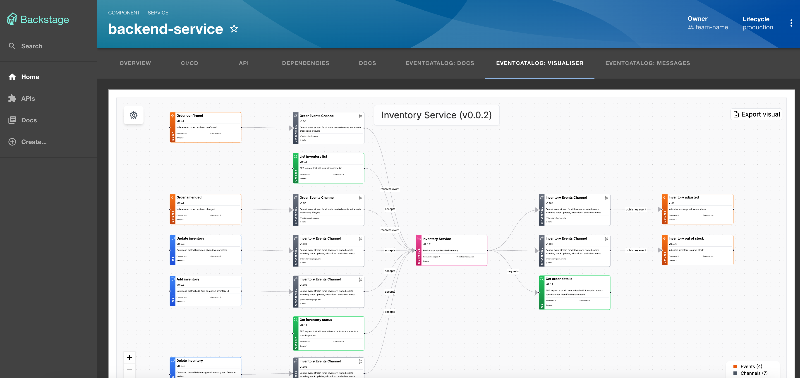

# Backstage EventCatalog Demo

Many folks are using Backstage for their internal developer portals. Backstage is a highly configurable platform that allows you to document your architecture in components, apis, services, domains and much more.

Backstage supports plugins, that have a frontend and backend support.

Using the EventCatalog Backstage plugin you can embed your EventCatalog information into backstage.

### Getting Started

To try out the plugin, you can use this example application.
This example application is a very basic Backstage application that integrates with the [EventCatalog demo website](https://demo.eventcatalog.dev).

### Running the example application

1. Clone the repository

```bash
git clone https://github.com/eventcatalog/backstage-plugin-eventcatalog.git
```

2. Install dependencies

```bash
npm install
```

3. Run the application

```bash
npm run start
```

4. Open the `backend-service` in your browser

```bash
http://localhost:3000/catalog/default/component/backend-service
```

This will show you EventCatalog embededd into the Backstage application through components and also individual pages.


### Components in Backstage


### Documentation in Backstage


### Visualizer in Backstage




You can read more about the plugin and how to get started on our [documentation site](https://www.eventcatalog.dev/docs/plugins/backstage/intro).

[If you want to learn more you can watch the video and get started here.](https://www.eventcatalog.dev/docs/development/plugins/backstage/intro)
